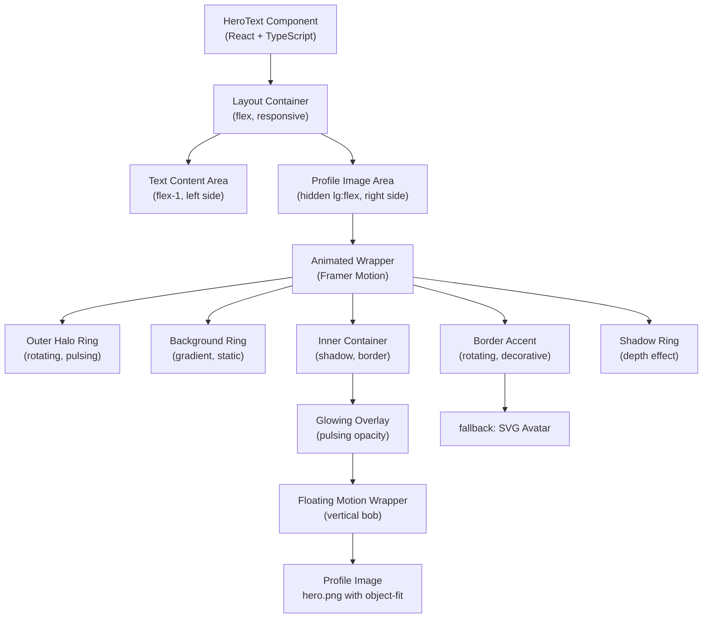

# Design Document: Hero Profile Image Redesign

## Overview

The hero section's profile image area presents a professional, polished component that replaces an SVG placeholder with an actual hero.png photograph. The design implements a modern circular frame with animated effects, maintaining smooth 60fps animations using GPU-accelerated transforms through Framer Motion. The component combines visual polish (gradient background rings, rotating halos, glowing accents, floating motion) with responsive behavior (hidden on mobile/tablet, visible on lg+ breakpoints), accessibility standards (semantic markup, alt text, ARIA attributes), and performance optimization (lazy loading, GPU acceleration, memory cleanup). This technical design bridges requirements and implementation, specifying exact CSS properties, animation timing, responsive breakpoints, and fallback strategies.

## Architecture

The HeroText component structures its profile image area as a responsive, animated hero section element with the following layers:



**Component Hierarchy**:
1. **HeroText** (root component)
2. **Layout Container** (flex row, responsive, max-width constraint)
3. **Text Content** (left side, flex-1 proportional sizing)
4. **Profile Image Area** (right side, hidden lg:flex responsive behavior)
5. **Animated Wrapper** (Framer Motion, perspective 3D)
6. **Multiple Animation Layers** (halo, background, glowing, floating)
7. **Image Element** (hero.png with object-fit: cover)

## Component Structure and Interfaces

### Main Component Interface

```typescript
interface HeroTextProps {
  // No required props - component is self-contained
  // All configuration via internal state and design constants
}

interface ProfileImageConfig {
  imageUrl: string;              // "/hero.png"
  fallbackImageUrl?: string;     // SVG fallback URL
  altText: string;               // "Sarvjeet Yadav - Full Stack Developer and AI Engineer"
  containerSize: number;         // 288px (w-72 h-72)
  lazyLoading: boolean;          // true for non-critical images, false (eager) for above-fold
  objectFit: 'cover' | 'contain'; // 'cover' (default)
  objectPosition: string;        // 'center'
}

interface AnimationConfig {
  haloRotation: {
    duration: number;            // 30 seconds
    ease: string;                // "linear"
  };
  haloPulse: {
    duration: number;            // 8 seconds
    ease: string;                // "easeInOut"
    scale: [number, number, number]; // [0.95, 1.05, 0.95]
  };
  floatingMotion: {
    duration: number;            // 6 seconds
    ease: string;                // "easeInOut"
    displacement: number;        // 12px
  };
  glowPulse: {
    duration: number;            // 4 seconds
    ease: string;                // "easeInOut"
    opacityRange: [number, number]; // [0.3, 0.6]
  };
  mountAnimation: {
    duration: number;            // 0.8 seconds
    delay: number;               // 0.5 seconds
    initialState: {
      opacity: number;           // 0
      scale: number;             // 0.8
      rotateY: number;           // -20
    };
    finalState: {
      opacity: number;           // 1
      scale: number;             // 1
      rotateY: number;           // 0
    };
  };
}

interface ColorScheme {
  primaryAccent: string;         // "hsl(73 100% 50%)" or "#ccff00"
  primaryOpacity: {
    border: number;              // 0.4 (40%)
    ring: {
      outer: number;             // 0.2 (20%)
      middle: number;            // 0.1 (10%)
      shadow: number;            // 0.2 (20%)
    };
    glowSubtle: number;          // 0.15 (15%)
    glowIntense: number;         // 0.6 (60%)
  };
}
```

### Key Components and Responsibilities

#### ProfileImageContainer

**Purpose**: Root wrapper for the profile image area with responsive visibility and flex layout

**Interface**:
```typescript
interface ProfileImageContainerProps {
  children: React.ReactNode;
  isVisible: boolean;            // true on lg breakpoint, false on sm/md
}
```

**Responsibilities**:
- Maintain flex-1 proportional sizing
- Hide on mobile/tablet (hidden lg:flex)
- Apply perspective for 3D effects
- Position on right side of layout
- Apply gap between text content (gap-12)

#### AnimatedFrameWrapper

**Purpose**: Orchestrate all animation layers using Framer Motion

**Interface**:
```typescript
interface AnimatedFrameWrapperProps {
  children: React.ReactNode;
  isVisible: boolean;
  animationConfig: AnimationConfig;
  shouldReduceMotion: boolean;   // respect prefers-reduced-motion
}
```

**Responsibilities**:
- Apply mount animation (opacity, scale, rotateY)
- Manage animation lifecycle (start, pause on unmount)
- Respect reduced motion preferences
- Clean up animation resources on unmount

#### HaloRing

**Purpose**: Rotating outer glow effect with pulsing scale

**Interface**:
```typescript
interface HaloRingProps {
  size: number;                  // 288px
  color: string;                 // hsl(73 100% 50% / 0.4)
  shouldReduceMotion: boolean;
}
```

**Responsibilities**:
- Rotate 360 degrees over 30 seconds (linear, infinite)
- Scale pulse: [0.95, 1.05, 0.95] over 8 seconds
- Apply blur filter (12px)
- Use conic-gradient for directional glow

#### BackgroundRing

**Purpose**: Static gradient ring providing visual separation and color accent

**Interface**:
```typescript
interface BackgroundRingProps {
  size: number;                  // 288px
  gradientColor: string;         // primary accent with opacity gradient
}
```

**Responsibilities**:
- Display gradient-to-br (top-right to bottom-left)
- Transition: primary/20 → primary/10 → transparent
- Provide subtle color accent
- Maintain 1:1 aspect ratio

#### InnerContentContainer

**Purpose**: Hold image with premium styling (shadow, border, inset effects)

**Interface**:
```typescript
interface InnerContentContainerProps {
  children: React.ReactNode;
  accentColor: string;
  showGlowEffect: boolean;
}
```

**Responsibilities**:
- Apply shadow-2xl for depth
- Apply border-2 with primary/40 opacity
- Apply inset shadow for embossed effect
- Contain glowing overlay animation
- Round corners (border-radius: 50%)

#### GlowingOverlay

**Purpose**: Animated pulsing glow effect overlay

**Interface**:
```typescript
interface GlowingOverlayProps {
  opacityRange: [number, number]; // [0.3, 0.6]
  duration: number;               // 4 seconds
  shouldReduceMotion: boolean;
}
```

**Responsibilities**:
- Animate opacity pulse
- Use gradient-to-t (top gradient)
- Add depth to profile image
- Non-interactive overlay

#### FloatingMotionWrapper

**Purpose**: Orchestrate vertical floating motion animation

**Interface**:
```typescript
interface FloatingMotionWrapperProps {
  children: React.ReactNode;
  displacement: number;           // 12px
  duration: number;               // 6 seconds
  shouldReduceMotion: boolean;
}
```

**Responsibilities**:
- Animate y-axis translation: [0, -12, 0]
- Apply easeInOut timing
- Repeat infinitely
- Clean up on unmount

#### ProfileImage

**Purpose**: Display actual hero.png photo with fallback

**Interface**:
```typescript
interface ProfileImageProps {
  src: string;                    // "/hero.png"
  alt: string;                    // descriptive alt text
  fallbackSrc?: string;           // SVG fallback
  objectFit: 'cover' | 'contain';
  objectPosition: string;
  loading: 'eager' | 'lazy';      // eager for above-fold
  onError?: () => void;           // trigger fallback
}
```

**Responsibilities**:
- Load and display hero.png
- Provide meaningful alt text
- Apply object-fit: cover with center position
- Fallback to SVG on load failure
- Support eager loading for performance

#### RotatingBorderAccent

**Purpose**: Decorative rotating border element

**Interface**:
```typescript
interface RotatingBorderAccentProps {
  size: number;                   // 288px
  duration: number;               // 25 seconds
  color: string;                  // hsl(73 100% 50%)
  shouldReduceMotion: boolean;
}
```

**Responsibilities**:
- Rotate 360 degrees continuously
- Use conic-gradient for visual interest
- Apply 3px padding
- Mark as decorative (aria-hidden)

#### ShadowRing

**Purpose**: Subtle shadow effect for depth perception

**Interface**:
```typescript
interface ShadowRingProps {
  size: number;                   // 288px
  color: string;                  // primary/20
  blur: string;                   // shadow-2xl
}
```

**Responsibilities**:
- Position -6px outside frame
- Apply primary/20 shadow color
- Create depth illusion
- Mark as decorative

## Styling Specifications

### Container Sizing and Responsive Behavior

```typescript
const CONTAINER_STYLES = {
  desktop: {
    width: '288px',              // w-72
    height: '288px',             // h-72
    display: 'flex',
    alignItems: 'center',
    justifyContent: 'center',
    visibility: 'visible',       // lg:flex
  },
  tablet: {
    display: 'none',             // md: flex, but hidden until lg
  },
  mobile: {
    display: 'none',             // hidden
  },
};

const LAYOUT_CONTAINER = {
  display: 'flex',
  flexDirection: 'row',
  alignItems: 'center',
  justifyContent: 'space-between',
  gap: '48px',                   // gap-12
  width: '100%',
  maxWidth: '80rem',             // max-w-7xl
  padding: '0 1rem',             // px-4 md:px-8
  margin: '0 auto',
};

const TEXT_AREA = {
  flex: 1,                       // flex-1 proportional sizing
  display: 'flex',
  flexDirection: 'column',
  gap: '32px',                   // space-y-8
  pointerEvents: 'auto',         // text is interactive
};

const IMAGE_AREA = {
  flex: 1,                       // flex-1 proportional sizing
  display: 'flex',
  alignItems: 'center',
  justifyContent: 'center',
  pointerEvents: 'none',         // decorative, non-interactive
  visibility: 'hidden',          // hidden (mobile)
  // lg: { display: 'flex', visibility: 'visible' }
};
```

**Responsive Breakpoints**:

| Breakpoint | Width | Display | Behavior |
|-----------|-------|---------|----------|
| sm (640px) | 640px+ | hidden | Image area not visible, text full width |
| md (768px) | 768px+ | hidden | Image area not visible, text full width |
| lg (1024px) | 1024px+ | flex | Image area visible, side-by-side layout |
| xl (1280px) | 1280px+ | flex | Image area visible, side-by-side layout |

### Circular Frame Styling

```typescript
const CIRCULAR_FRAME = {
  position: 'relative',
  width: '288px',                // w-72
  height: '288px',               // h-72
  borderRadius: '50%',           // perfect circle
  aspectRatio: '1 / 1',          // maintain square -> circle
};

const INNER_CONTAINER = {
  position: 'relative',
  width: '100%',
  height: '100%',
  borderRadius: '50%',
  overflow: 'hidden',            // clip content to circle
  background: 'linear-gradient(to bottom right, hsl(0 0% 10%), hsl(0 0% 8%))',
  boxShadow: '0 20px 25px -5px rgba(0, 0, 0, 0.1)',  // shadow-2xl
  border: '2px solid hsl(73 100% 50% / 0.4)',        // 40% opacity primary
};

const PREMIUM_INSET_SHADOW = {
  boxShadow: 'inset 0 1px 20px rgba(204, 255, 0, 0.15)',
  border: '2px solid hsl(73 100% 50% / 0.4)',
};
```

### Gradient and Color Specifications

```typescript
const COLOR_PALETTE = {
  primary: {
    full: 'hsl(73 100% 50%)',    // #ccff00
    opacity: {
      '40': 'hsl(73 100% 50% / 0.4)',    // border
      '20': 'hsl(73 100% 50% / 0.2)',    // outer ring
      '15': 'hsl(73 100% 50% / 0.15)',   // subtle glow
      '10': 'hsl(73 100% 50% / 0.1)',    // ring fade
      '60': 'hsl(73 100% 50% / 0.6)',    // intense glow
    },
  },
};

const GRADIENT_DEFINITIONS = {
  backgroundRing: {
    direction: 'to bottom right',  // top-left to bottom-right
    stops: [
      'hsl(73 100% 50% / 0.2)',   // 20% opacity at start
      'hsl(73 100% 50% / 0.1)',   // 10% opacity in middle
      'transparent',               // fade to transparent
    ],
  },
  haloRing: {
    type: 'conic-gradient',
    direction: 'from 0deg',
    stops: [
      'hsl(73 100% 50% / 0.4)',
      'hsl(73 100% 50% / 0.1)',
      'hsl(73 100% 50% / 0.4)',
    ],
    blur: '12px',                  // filter: blur(12px)
  },
  rotatingBorderAccent: {
    type: 'conic-gradient',
    direction: 'from 90deg',
    stops: [
      'hsl(73 100% 50% / 0.6)',   // 60% opacity
      'transparent 25%',
      'transparent 75%',
      'hsl(73 100% 50% / 0.6)',
    ],
  },
  glowingOverlay: {
    type: 'linear-gradient',
    direction: 'to top',           // gradient-to-t
    stops: [
      'hsl(73 100% 50% / 0.05)',  // bottom (subtle)
      'transparent',               // top
    ],
  },
};
```

### Image Styling

```typescript
const IMAGE_STYLES = {
  width: '100%',
  height: '100%',
  objectFit: 'cover',             // fill circle without distortion
  objectPosition: 'center',       // center the visible portion
  borderRadius: '50%',            // maintain circular shape
  display: 'block',               // remove inline spacing
};

const IMAGE_CONTAINER = {
  width: '100%',
  height: '100%',
  display: 'flex',
  alignItems: 'center',
  justifyContent: 'center',
  position: 'relative',
};
```

### Z-index and Layer Structure

```typescript
const Z_INDEX_LAYERS = {
  shadowRing: 0,                  // -inset-6 positioned outside
  background: 1,                  // background ring gradient
  innerContainer: 2,              // main frame with image
  border: 3,                      // border-2 with primary color
  insetShadow: 4,                 // inset shadow overlay
  image: 5,                       // actual profile image
  glowingOverlay: 6,              // pulsing glow on top
  floatingWrapper: 7,             // animation wrapper
  haloRing: 8,                    // outer rotating halo
  rotatingBorder: 9,              // rotating border accent
};

// Mermaid z-index visualization:
// (bottom to top)
// 0: Shadow ring (outside)
// 1: Background ring (gradient)
// 2: Inner container (base)
// 3: Border (2px primary)
// 4: Inset shadow (embossed)
// 5: Profile image (hero.png)
// 6: Glowing overlay (pulsing)
// 7: Floating wrapper (animation)
// 8: Halo ring (rotating)
// 9: Border accent (decorative)
```

## Animation Specifications

### 1. Halo Ring Animation (Outer Rotating Glow)

**Purpose**: Continuous rotating effect creating visual movement and interest

**Framer Motion Configuration**:
```typescript
const haloRingAnimation = {
  animate: {
    rotate: [-360, 0],            // full 360° rotation reversed
    scale: [0.95, 1.05, 0.95],    // pulsing scale
  },
  transition: {
    rotate: {
      duration: 30,               // 30 seconds per rotation
      repeat: Infinity,           // infinite loop
      ease: 'linear',             // constant speed
    },
    scale: {
      duration: 8,                // 8 seconds per pulse
      repeat: Infinity,           // infinite loop
      ease: 'easeInOut',          // smooth acceleration/deceleration
    },
  },
};

// CSS Timing Function
easeInOut: (t) => t < 0.5 ? 2 * t * t : -1 + 2 * (2 - t) * t;
// Linear: constant velocity (no interpolation)
```

**Easing Curve Analysis**:
- **Linear (rotation)**: Constant velocity ensures smooth, predictable rotation. No acceleration = no jank.
- **easeInOut (scale)**: Provides breathing effect. Accelerates out of 0.95, peaks at 1.05, decelerates back to 0.95.

**Performance**:
- Only `transform` property changes (GPU-accelerated)
- `conic-gradient` background stays static
- 60fps on modern hardware

**Reduced Motion**:
- Disable rotate animation
- Disable scale animation
- Keep halo visible but static

### 2. Halo Pulse Animation (Scale Breathing)

**Purpose**: Synchronized with rotation, creates breathing/pulsing effect

**Timing**:
- Duration: 8 seconds
- Keyframes: scale [0.95, 1.05, 0.95]
- Easing: easeInOut
- Repeat: Infinity

**Visual Effect**:
- Halo appears to "breathe" outward and inward
- Synchronized with rotation creates mesmerizing effect
- Lower scale (0.95) appears closer, higher (1.05) appears farther
- Creates depth illusion on 2D surface

### 3. Floating Motion Animation (Vertical Bob)

**Purpose**: Gentle upward/downward motion creating sense of weightlessness

**Framer Motion Configuration**:
```typescript
const floatingMotion = {
  animate: {
    y: [0, -12, 0],               // move up 12px, return
  },
  transition: {
    duration: 6,                  // 6 seconds per cycle
    repeat: Infinity,             // infinite loop
    ease: 'easeInOut',            // smooth acceleration/deceleration
  },
};

// At t=0: y = 0 (resting position)
// At t=0.5 (3 seconds): y = -12px (peak)
// At t=1 (6 seconds): y = 0 (return to rest)
```

**Visual Effect**:
- Profile image appears to float up and down
- 12px displacement = noticeable but not distracting
- 6-second cycle = slow, meditative rhythm
- easeInOut = smooth motion without snappiness

**Accessibility**:
- On prefers-reduced-motion: disable animation
- Display image at y=0 (static)

### 4. Glow Pulsing Animation (Opacity Breathing)

**Purpose**: Animated opacity effect on overlay creating glow intensity variation

**Framer Motion Configuration**:
```typescript
const glowPulseAnimation = {
  animate: {
    opacity: [0.3, 0.6, 0.3],    // pulse between 30% and 60%
  },
  transition: {
    duration: 4,                  // 4 seconds per cycle
    repeat: Infinity,             // infinite loop
    ease: 'easeInOut',            // smooth acceleration/deceleration
  },
};

// At t=0: opacity = 0.3 (subtle)
// At t=0.5 (2 seconds): opacity = 0.6 (intense)
// At t=1 (4 seconds): opacity = 0.3 (subtle)
```

**Visual Effect**:
- Overlay appears to pulse/breathe in intensity
- 0.3 opacity = barely visible glow
- 0.6 opacity = prominent glow effect
- Creates dynamic, living appearance

### 5. Mount Animation (Entry Effect)

**Purpose**: Profile image animates in when component mounts

**Framer Motion Configuration**:
```typescript
const mountAnimation = {
  initial: {
    opacity: 0,                   // invisible
    scale: 0.8,                   // 20% smaller
    rotateY: -20,                 // rotated 20° away
  },
  animate: {
    opacity: 1,                   // fully visible
    scale: 1,                     // normal size
    rotateY: 0,                   // front-facing
  },
  transition: {
    duration: 0.8,                // 0.8 seconds
    delay: 0.5,                   // 0.5 second stagger (after text starts animating)
  },
};

// Perspective: 1000px (3D effect depth)
// rotateY: -20 means rotated 20° around Y-axis
// Creates "unfold" effect: image starts rotated away, rotates into view
```

**Visual Effect**:
- Image slides in from the side (3D rotation)
- Simultaneously scales from small to full size
- Fades from invisible to visible
- Staggered delay (0.5s) = appears after text intro
- Total animation: 0.8 seconds

**3D Transform Details**:
```typescript
// CSS perspective creates 3D space
perspective: 1000,

// rotateY rotates around the Y-axis (vertical line through center)
// positive = clockwise from viewer's perspective
// negative = counterclockwise (rotated away, like turning page)
transform: 'perspective(1000px) rotateY(-20deg)',

// During animation: rotateY goes from -20 to 0
// Creates "unfold" effect: image starts partially hidden, rotates into view
```

### Animation Timing Summary

| Animation | Duration | Delay | Easing | Repeat | Purpose |
|-----------|----------|-------|--------|--------|---------|
| Halo Rotation | 30s | N/A | linear | Infinity | Continuous rotation |
| Halo Pulse | 8s | offset | easeInOut | Infinity | Scale breathing |
| Floating Motion | 6s | offset | easeInOut | Infinity | Vertical bob |
| Glow Pulse | 4s | offset | easeInOut | Infinity | Opacity pulsing |
| Mount Animation | 0.8s | 0.5s | default | once | Entry effect |
| Border Accent | 25s | N/A | linear | Infinity | Rotating accent |

### Performance Optimizations

```typescript
const PERFORMANCE_OPTIMIZATIONS = {
  gpu_acceleration: {
    willChange: 'auto',           // applied to animated parent
    transform3d: true,            // enable hardware acceleration
    containLayout: true,          // contain: layout reduces reflow
  },
  animations_only_gpu_properties: {
    allowed: ['transform', 'opacity'],
    avoid: ['width', 'height', 'top', 'left', 'padding', 'margin'],
  },
  cleanup_strategy: {
    pauseOnUnmount: true,         // clean up on component unmount
    cancelAnimationFrame: true,   // cancel RAF in cleanup
  },
  reduced_motion: {
    disableAnimations: true,      // respect prefers-reduced-motion
    displayStatic: true,          // show image at final position
  },
};
```

## Responsive Behavior

### Mobile (sm: 320px - 639px)

**Profile Image Area**: Hidden
- `display: none`
- Animations: Not initialized
- Layout: Text area takes full width (flex-1 grows to fill)
- Image Resources: Not loaded (save bandwidth on mobile)

### Tablet (md: 768px - 1023px)

**Profile Image Area**: Hidden
- `display: none`
- Animations: Not initialized
- Layout: Text area takes full width
- Image Resources: Not loaded

### Desktop (lg: 1024px+)

**Profile Image Area**: Visible
- `display: flex`
- Animations: Initialize and run
- Layout: Text (flex-1) + Gap (48px) + Image (flex-1)
- Image Resources: Load eagerly (above-fold)
- Container Size: 288px × 288px (w-72 h-72)

### Layout Transition (md to lg)

**Transition Behavior**:
```typescript
// At 1023px and below
{
  display: 'none',               // hidden
  opacity: 'N/A',                // not calculated
  animations: 'not running',     // not initialized
}

// At 1024px and above
{
  display: 'flex',               // visible
  opacity: [0, 1],               // fade in via mount animation
  animations: 'start running',   // initialize and begin
  duration: '0.8s',              // mount animation
  delay: '0.5s',                 // stagger from text
}
```

**No Layout Shift**:
- Image appears to the right of text
- Text content doesn't reflow
- Viewport adjusts proportionally
- No CLS (Cumulative Layout Shift) violation

### Responsive CSS Classes

```tsx
// Tailwind CSS breakpoint utilities
className={`
  hidden              // default: hidden on all breakpoints
  lg:flex             // lg+: flex layout
  flex-1              // proportional sizing
  items-center        // vertical centering
  justify-center      // horizontal centering
  pointer-events-none // decorative
`}

// Alternate using media queries
@media (max-width: 1023px) {
  .profile-image { display: none; }
}

@media (min-width: 1024px) {
  .profile-image { display: flex; }
}
```

## Image Loading and Fallback Strategy

### Primary Image Loading (hero.png)

**Initial Load**:
```typescript
const imageProps = {
  src: '/hero.png',
  alt: 'Sarvjeet Yadav - Full Stack Developer and AI Engineer',
  loading: 'eager',               // eager loading for above-fold content
  objectFit: 'cover',
  objectPosition: 'center',
};

// Image loads immediately when component mounts on lg+ breakpoints
// Below lg breakpoints: image not loaded (display: none)
```

**Image Optimization**:
- File: `/public/hero.png`
- Recommended size: 600×600px or higher
- Format: PNG (transparency support) or JPEG (smaller file size)
- Compression: Optimize using ImageOptim, TinyPNG, or similar
- Responsive: Consider using srcset for different screen sizes

### Fallback Strategy (Error Handling)

**Scenario 1: Image fails to load**
```typescript
const handleImageError = () => {
  // Option 1: Display SVG placeholder
  setShowFallback(true);
  
  // Option 2: Log error for monitoring
  console.warn('Failed to load hero.png, displaying SVG fallback');
};

// Render fallback
{isImageLoaded && }
{!isImageLoaded && <SVGPlaceholder role="img" aria-label={altText} />}
```

**Scenario 2: Network error or slow connection**
- Image begins loading (eager)
- If load fails within timeout: display SVG
- SVG should match circular frame styling
- Smooth transition: fade out image, fade in SVG

**Scenario 3: Image hidden on mobile**
- Display: none prevents loading request
- No fallback needed on mobile (entire area hidden)
- When resizing to lg breakpoint: trigger load if needed

### SVG Fallback Implementation

```tsx
const SVGPlaceholder = ({ altText }: { altText: string }) => (
  <svg
    viewBox="0 0 288 288"
    className="w-full h-full text-primary"
    role="img"
    aria-label={altText}
  >
    <circle cx="144" cy="144" r="140" fill="currentColor" opacity="0.1" />
    <text x="144" y="144" textAnchor="middle" dy="0.3em" className="fill-current text-sm font-semibold">
      {altText}
    </text>
  </svg>
);
```

**Fallback Styling**:
- Maintains circular shape
- Uses primary color with 10% opacity
- Shows placeholder text
- Semantic alt text provided

## Accessibility Implementation

### Alt Text

```tsx
const altText = 'Sarvjeet Yadav - Full Stack Developer and AI Engineer';


```

**Alt Text Guidelines**:
- Specific and descriptive
- Includes name and primary role
- No "image of" prefix (redundant for screen readers)
- Contextual to page purpose
- First person perspective (professional portfolio convention)

### Semantic Markup

```tsx
<article
  className="flex-1 pointer-events-none space-y-8"
  itemScope
  itemType="https://schema.org/Person"
>
  {/* Text content */}
  <h1 itemProp="name">Sarvjeet Yadav</h1>
  <p itemProp="jobTitle">Full Stack Developer & AI Engineer</p>
  <p itemProp="description">...</p>
  
  {/* Profile image area */}
  
  
  <meta itemProp="url" content="https://sarvjeetyadav.dev" />
  <meta itemProp="email" content="sarvjeetyadav2969@gmail.com" />
</article>
```

**Schema.org Person Structure**:
- itemScope: defines scope
- itemType: specifies schema.org/Person
- itemProp: properties within Person schema
- image property: connects image to person

### ARIA Attributes

```tsx
// Decorative elements marked as aria-hidden
<motion.div
  animate={{ rotate: 360 }}
  aria-hidden="true"  // decorative, skip in screen reader
  className="absolute inset-0 rounded-full"
/>

// Image marked as non-decorative


// Navigation marked with aria-label
<nav aria-label="Quick navigation">
  <button>Contact Me</button>
  <button>Discover</button>
</nav>
```

### Reduced Motion Support

```typescript
const prefersReducedMotion = window.matchMedia('(prefers-reduced-motion: reduce)').matches;

<motion.div
  animate={prefersReducedMotion ? { y: 0 } : { y: [0, -12, 0] }}
  transition={prefersReducedMotion ? {} : { duration: 6, repeat: Infinity }}
>
  {/* Content */}
</motion.div>

// Or use media query
@media (prefers-reduced-motion: reduce) {
  * {
    animation-duration: 0.01ms !important;
    animation-iteration-count: 1 !important;
    transition-duration: 0.01ms !important;
  }
}
```

**Reduced Motion Behavior**:
- All animations disabled (rotation, pulse, floating, glow)
- Image displays at static position
- No animated mounts or transitions
- Respects user accessibility preferences

### Focus and Keyboard Navigation

```tsx
<button
  onClick={() => document.getElementById('contact')?.scrollIntoView()}
  className="... focus:outline-none focus:ring-2 focus:ring-primary focus:ring-offset-2 ..."
  aria-label="Contact Sarvjeet Yadav"
>
  Contact Me
</button>

// Sufficient color contrast
// WCAG AA: 4.5:1 for normal text, 3:1 for large text
// Acid green (#ccff00) on dark background: ~10:1 contrast ✓
```

### Screen Reader Testing

**With NVDA/JAWS**:
1. Focus on profile image area
2. Hear: "image, Sarvjeet Yadav - Full Stack Developer and AI Engineer"
3. Decorative elements (halos, rings) skipped
4. Navigation buttons announced correctly

## Testing Strategy

### Unit Tests

**Profile Image Loading**:
```typescript
describe('ProfileImage', () => {
  it('should render image with correct src', () => {
    render(<ProfileImage src="/hero.png" alt="..." />);
    const img = screen.getByRole('img');
    expect(img).toHaveAttribute('src', '/hero.png');
  });
  
  it('should have descriptive alt text', () => {
    render(<ProfileImage alt="Sarvjeet Yadav - Full Stack Developer and AI Engineer" />);
    const img = screen.getByRole('img');
    expect(img).toHaveAttribute('alt', expect.stringContaining('Sarvjeet'));
  });
  
  it('should apply object-fit cover', () => {
    render(<ProfileImage />);
    const img = screen.getByRole('img');
    expect(img).toHaveClass('object-cover');
  });
});
```

**Fallback Rendering**:
```typescript
describe('ProfileImage Fallback', () => {
  it('should display SVG fallback on image load error', async () => {
    const { rerender } = render(<ProfileImage src="invalid.png" />);
    const img = screen.getByRole('img');
    fireEvent.error(img);
    await waitFor(() => {
      expect(screen.getByText(/placeholder|fallback/i)).toBeInTheDocument();
    });
  });
});
```

**Responsive Visibility**:
```typescript
describe('Responsive Behavior', () => {
  it('should hide on mobile (sm breakpoint)', () => {
    window.matchMedia = () => ({ matches: false, media: '(min-width: 1024px)' });
    render(<HeroText />);
    const imageArea = screen.queryByRole('img');
    // May be display: none, not visible
  });
  
  it('should display on desktop (lg breakpoint)', () => {
    window.matchMedia = () => ({ matches: true, media: '(min-width: 1024px)' });
    render(<HeroText />);
    const imageArea = screen.getByRole('img');
    expect(imageArea).toBeVisible();
  });
});
```

### Animation Tests (Integration)

**Animation Initialization**:
```typescript
describe('Animations', () => {
  it('should initialize halo rotation on mount', async () => {
    const { container } = render(<HeroText />);
    const halo = container.querySelector('[data-halo-ring]');
    
    await waitFor(() => {
      const styles = window.getComputedStyle(halo);
      expect(styles.transform).toMatch(/rotate/);
    });
  });
  
  it('should animate floating motion', async () => {
    const { container } = render(<HeroText />);
    const floatingWrapper = container.querySelector('[data-floating-motion]');
    
    // Check animation is running
    const animation = floatingWrapper?.getAnimations()[0];
    expect(animation?.playState).toBe('running');
  });
  
  it('should respect prefers-reduced-motion', () => {
    window.matchMedia = () => ({
      matches: true,
      media: '(prefers-reduced-motion: reduce)',
    });
    
    const { container } = render(<HeroText />);
    const animated = container.querySelectorAll('[animate]');
    
    // Animations should be disabled
    animated.forEach(el => {
      const animation = el.getAnimations()[0];
      expect(animation?.playState).toBe('paused');
    });
  });
});
```

### Performance Tests

**60fps Animation Check**:
```typescript
describe('Performance', () => {
  it('should maintain 60fps on animations', (done) => {
    const { container } = render(<HeroText />);
    let frameCount = 0;
    let lastTime = performance.now();
    
    const checkFrameRate = () => {
      frameCount++;
      const now = performance.now();
      const elapsed = now - lastTime;
      
      if (frameCount === 60) {
        const fps = 1000 / (elapsed / 60);
        expect(fps).toBeGreaterThan(50); // Allow 50fps minimum
        done();
      } else {
        requestAnimationFrame(checkFrameRate);
      }
    };
    
    requestAnimationFrame(checkFrameRate);
  });
  
  it('should use GPU-accelerated properties only', () => {
    const { container } = render(<HeroText />);
    const animated = container.querySelector('[animate]');
    
    // Should only have transform and opacity in animation
    const keyframes = animated.getAnimations()[0].effect.getKeyframes();
    keyframes.forEach(frame => {
      const hasGPUProperties = 'transform' in frame || 'opacity' in frame;
      const hasNonGPUProperties = ['width', 'height', 'left', 'top', 'padding'].some(
        prop => prop in frame
      );
      expect(hasGPUProperties || Object.keys(frame).length === 0).toBe(true);
      expect(hasNonGPUProperties).toBe(false);
    });
  });
});
```

### Visual Regression Tests

**Styling Snapshot**:
```typescript
describe('Visual Regression', () => {
  it('should match snapshot for circular frame', () => {
    const { container } = render(<HeroText />);
    const frame = container.querySelector('[data-frame]');
    expect(frame).toMatchSnapshot();
  });
  
  it('should match snapshot for profile image area', () => {
    const { container } = render(<HeroText />);
    const imageArea = container.querySelector('[data-image-area]');
    expect(imageArea).toMatchSnapshot();
  });
});
```

### Accessibility Tests

**Alt Text Verification**:
```typescript
describe('Accessibility', () => {
  it('should have meaningful alt text', () => {
    render(<HeroText />);
    const img = screen.getByRole('img');
    expect(img.getAttribute('alt')).toBe('Sarvjeet Yadav - Full Stack Developer and AI Engineer');
  });
  
  it('should not have aria-hidden on meaningful images', () => {
    render(<HeroText />);
    const img = screen.getByRole('img');
    expect(img).not.toHaveAttribute('aria-hidden');
  });
  
  it('should have aria-hidden on decorative elements', () => {
    const { container } = render(<HeroText />);
    const decorative = container.querySelector('[data-decorative]');
    expect(decorative).toHaveAttribute('aria-hidden', 'true');
  });
});
```

### Integration Tests

**Complete Component Flow**:
```typescript
describe('HeroText Integration', () => {
  it('should render complete hero section with text and image', () => {
    render(<HeroText />);
    
    // Text content
    expect(screen.getByText(/Sarvjeet/i)).toBeInTheDocument();
    expect(screen.getByText(/Full Stack Developer/i)).toBeInTheDocument();
    
    // Image area
    expect(screen.getByRole('img')).toBeInTheDocument();
    
    // Buttons
    expect(screen.getByLabelText(/Contact/i)).toBeInTheDocument();
    expect(screen.getByLabelText(/Discover/i)).toBeInTheDocument();
  });
  
  it('should load image and display animations on lg breakpoint', async () => {
    // Simulate lg breakpoint
    window.matchMedia = () => ({ matches: true });
    
    render(<HeroText />);
    
    const img = screen.getByRole('img');
    expect(img).toBeVisible();
    
    // Animation should be running
    await waitFor(() => {
      expect(img.closest('[animate]')).toBeInTheDocument();
    });
  });
});
```

### Browser Compatibility Testing

**Browsers to Test**:
- Chrome 90+ (primary)
- Safari 14+ (GPU acceleration, perspective 3D)
- Firefox 88+ (CSS Grid, transforms)
- Edge 90+

**Features to Verify**:
- CSS Grid and Flexbox
- Transform and perspective
- Conic-gradient
- Object-fit and object-position
- Framer Motion animations
- matchMedia() for reduced motion

## Performance Optimization Strategies

### 1. Image Optimization

```typescript
// Recommended image specs
{
  format: 'WebP with PNG fallback',
  dimension: '600px × 600px or higher',
  fileSize: '< 100KB',
  quality: 85,
  compression: 'lossy',
}

// HTML
<picture>
  <source srcSet="/hero.webp" type="image/webp" />
  
</picture>
```

### 2. GPU Acceleration

```typescript
// Apply to animated parent
{
  willChange: 'auto',  // Tell browser to prepare for transforms
  transform: 'translateZ(0)',  // Force GPU acceleration
  backfaceVisibility: 'hidden',  // Hide back face (3D)
}

// Only animate GPU properties
{
  animate: {
    transform: '...',  // GPU accelerated
    opacity: 0.5,      // GPU accelerated
  },
  // NOT animating width, height, left, top, etc.
}
```

### 3. Code Splitting

```typescript
// Lazy load HeroText component (optional, not required for above-fold)
const HeroText = lazy(() => import('./dom/HeroText'));

<Suspense fallback={<Skeleton />}>
  <HeroText />
</Suspense>
```

### 4. Animation Cleanup

```typescript
useEffect(() => {
  const animation = controls.start(...);
  
  return () => {
    // Cleanup on unmount
    animation.stop();
    cancelAnimationFrame(frameId);
  };
}, []);
```

### 5. Conditional Animation Initialization

```typescript
const prefersReducedMotion = window.matchMedia('(prefers-reduced-motion: reduce)').matches;
const isDesktop = window.matchMedia('(min-width: 1024px)').matches;

// Only initialize animations on desktop without reduced motion
if (!prefersReducedMotion && isDesktop) {
  startAnimations();
}
```

## Correctness Properties

*A property is a formal statement about what the system should do—something that must be true across all valid uses of the component.*

### Property 1: Image Circular Frame Aspect Ratio Preservation

*For any* image source and viewport width above lg breakpoint, the circular frame SHALL maintain a perfect 1:1 aspect ratio (square rendered as circle) without distortion to the image content.

**Validates: Requirements 1.2, 3.1**

### Property 2: Object-fit Cover Centering

*For any* hero.png image with any aspect ratio, applying `object-fit: cover` and `object-position: center` SHALL fill the circular frame while centering the visible portion and cropping edges proportionally.

**Validates: Requirements 1.2, 3.3**

### Property 3: Responsive Visibility Toggle

*For any* viewport width, when width crosses the lg breakpoint (1024px) threshold in either direction, the profile image area visibility SHALL toggle (hidden ↔ flex) without causing content reflow or layout shift in the text area.

**Validates: Requirements 4.1, 6.1, 6.2**

### Property 4: Halo Ring Continuous Rotation

*For any* animation frame interval, the halo ring SHALL complete exactly one full 360-degree rotation in 30 seconds with linear easing, running continuously without pause or stall on 60fps-capable hardware.

**Validates: Requirements 5.1**

### Property 5: Floating Motion Vertical Displacement

*For any* animation cycle, the inner content wrapper SHALL complete one full cycle of vertical motion (y: [0, -12, 0]) in exactly 6 seconds with easeInOut timing, maintaining smooth acceleration and deceleration throughout.

**Validates: Requirements 5.3, 5.4**

### Property 6: Glow Pulse Opacity Animation

*For any* animation cycle, the glowing accent overlay SHALL smoothly pulse opacity between 0.3 and 0.6 over a 4-second cycle with easeInOut easing, repeating infinitely without visual discontinuity.

**Validates: Requirements 5.5**

### Property 7: Mount Animation Complete State

*For any* HeroText component mount, the profile image area SHALL transition from initial state (opacity: 0, scale: 0.8, rotateY: -20) to final state (opacity: 1, scale: 1, rotateY: 0) in 0.8 seconds with 0.5-second delay, arriving at fully visible, front-facing, full-scale state.

**Validates: Requirements 5.6**

### Property 8: Reduced Motion Animations Disabled

*For any* user with `prefers-reduced-motion: reduce` media query preference enabled, all animated elements in the profile image area SHALL be displayed in their final static state without animation playback or CSS animation/transition application.

**Validates: Requirements 6.5**

### Property 9: SVG Fallback on Image Load Failure

*For any* image load failure or timeout condition, the HeroText component SHALL gracefully display the SVG placeholder avatar while maintaining all styling (circular frame, border, shadows) and semantic accessibility markup.

**Validates: Requirements 1.3**

### Property 10: Alt Text Accessibility

*For any* image element in the HeroText component, the alt attribute SHALL contain descriptive text identifying the person and professional role without redundancy, allowing screen reader users to understand image context.

**Validates: Requirements 1.4, 10.1, 10.2**

### Property 11: GPU Acceleration Performance

*For any* animated element in the profile image area, animation properties SHALL only include `transform` and `opacity` (GPU-accelerated), never animating layout-affecting properties like `width`, `height`, `padding`, or `margin`, maintaining 60fps animation performance.

**Validates: Requirements 8.3, 8.7**

### Property 12: Color Consistency Across Layers

*For any* accent color element (border, halo, glow, shadow), the color SHALL use the primary accent (`hsl(73 100% 50%)`) with specified opacity levels (40% border, 20% ring, 15% glow, 60% intense glow) ensuring visual cohesion across the design.

**Validates: Requirements 9.1 through 9.6**

### Property 13: Semantic HTML Structure

*For any* rendered HeroText component, the markup SHALL maintain valid document outline with proper nesting of header, nav, and article elements, including schema.org/Person itemScope with itemType and appropriate itemProp attributes on text and image content.

**Validates: Requirements 10.3, 10.7**

### Property 14: Animation State Cleanup

*For any* component unmount event, all Framer Motion animations running in the profile image area SHALL be properly cancelled and cleaned up to prevent memory leaks, dangling animation frames, or continued rendering cycles.

**Validates: Requirements 8.5**

## CSS Custom Properties and Tailwind Configuration

### CSS Variables (Design Tokens)

```css
:root {
  /* Primary Accent Color (Acid Green) */
  --primary: 73 100% 50%;        /* HSL without % for hsl() function */
  --primary-hex: #ccff00;

  /* Container Sizes */
  --profile-size: 288px;         /* w-72 h-72 */
  --profile-gap: 48px;           /* gap-12 */

  /* Animation Durations */
  --halo-duration: 30s;
  --pulse-duration: 8s;
  --float-duration: 6s;
  --glow-duration: 4s;
  --border-duration: 25s;
  --mount-duration: 0.8s;
  --mount-delay: 0.5s;

  /* Opacity Levels */
  --primary-border: 0.4;         /* 40% */
  --primary-ring-outer: 0.2;     /* 20% */
  --primary-ring-inner: 0.1;     /* 10% */
  --primary-shadow: 0.2;         /* 20% */
  --glow-subtle: 0.15;           /* 15% */
  --glow-intense: 0.6;           /* 60% */
}
```

### Tailwind Configuration Extensions

```javascript
// tailwind.config.js
module.exports = {
  theme: {
    extend: {
      colors: {
        primary: 'hsl(73 100% 50%)',  // #ccff00
      },
      width: {
        '72': '288px',
      },
      height: {
        '72': '288px',
      },
      gap: {
        '12': '48px',
      },
      zIndex: {
        '1': '1',
        '2': '2',
        '3': '3',
        '4': '4',
        '5': '5',
        '6': '6',
        '7': '7',
        '8': '8',
        '9': '9',
      },
      keyframes: {
        'halo-rotate': {
          'from': { transform: 'rotate(-360deg)' },
          'to': { transform: 'rotate(0deg)' },
        },
        'float': {
          '0%, 100%': { transform: 'translateY(0)' },
          '50%': { transform: 'translateY(-12px)' },
        },
      },
      animation: {
        'halo-rotate': 'halo-rotate 30s linear infinite',
        'float': 'float 6s ease-in-out infinite',
      },
    },
  },
};
```

## Error Handling and Edge Cases

### Edge Case 1: Image Load Timeout

**Scenario**: Network is very slow or image fetch times out

**Handling**:
```typescript
const handleImageLoadTimeout = () => {
  const timeout = setTimeout(() => {
    setImageFailed(true);
  }, 5000);  // 5-second timeout
  
  return () => clearTimeout(timeout);
};

// On timeout: display SVG fallback
```

### Edge Case 2: Viewport Resize (md → lg)

**Scenario**: User resizes browser window from tablet to desktop

**Handling**:
```typescript
useEffect(() => {
  const mediaQuery = window.matchMedia('(min-width: 1024px)');
  
  const handleChange = (e) => {
    if (e.matches) {
      // Transition to lg breakpoint
      // Mount animation should play
      triggerMountAnimation();
    } else {
      // Transition below lg breakpoint
      // Pause animations, hide image
      pauseAnimations();
    }
  };
  
  mediaQuery.addEventListener('change', handleChange);
  return () => mediaQuery.removeEventListener('change', handleChange);
}, []);
```

### Edge Case 3: Prefers Reduced Motion Toggle

**Scenario**: User changes accessibility settings while page is open

**Handling**:
```typescript
useEffect(() => {
  const mediaQuery = window.matchMedia('(prefers-reduced-motion: reduce)');
  
  const handleChange = (e) => {
    if (e.matches) {
      // Disable animations
      pauseAllAnimations();
    } else {
      // Re-enable animations
      resumeAnimations();
    }
  };
  
  mediaQuery.addEventListener('change', handleChange);
  return () => mediaQuery.removeEventListener('change', handleChange);
}, []);
```

### Edge Case 4: Very Large Screens (4K, 5K)

**Scenario**: User on ultra-wide or 4K monitor

**Handling**:
```typescript
// Container size remains 288px (doesn't scale up)
// Layout proportions maintained (flex-1 sizing handles scaling)
// Image quality: 600px×600px image sufficient for 4x pixel density

// Optional: Consider 2x image for higher DPI
<picture>
  <source srcSet="/hero@2x.png" media="(min-resolution: 192dpi)" />
  
</picture>
```

### Edge Case 5: System Dark/Light Mode Changes

**Scenario**: User toggles system theme while page is open

**Handling**:
```typescript
// Design uses CSS custom properties for colors
// Update CSS variables on theme change
const handleThemeChange = (isDark) => {
  document.documentElement.style.setProperty(
    '--primary-alpha',
    isDark ? '0.4' : '0.3'
  );
};

// Media query listener
window.matchMedia('(prefers-color-scheme: dark)').addEventListener('change', handleThemeChange);
```

## Notes and Recommendations

1. **Image Quality**: Ensure hero.png is optimized for web delivery (≈100KB for 600×600px)
2. **Browser Support**: Test on Chrome, Safari, Firefox, Edge; all support CSS Grid, transforms, conic-gradient
3. **Animation Testing**: Use DevTools Performance tab to verify 60fps; check Task Manager for GPU acceleration
4. **Accessibility Audit**: Run axe DevTools, Lighthouse, NVDA/JAWS screen reader testing
5. **Mobile UX**: Profile image hidden on mobile reduces cognitive load; text-focused design on small screens
6. **Performance Budget**: Profile image area adds ~200KB; monitor Core Web Vitals
7. **Fallback Testing**: Test with network throttling in DevTools to verify SVG fallback behavior
8. **Animation Cleanup**: Verify no memory leaks with React DevTools Profiler; check for dangling timeouts
9. **Color Contrast**: Acid green (#ccff00) provides excellent contrast on dark backgrounds (>10:1)
10. **Future Enhancements**: Consider adding quote card below image (Requirement 7) with staggered animation

